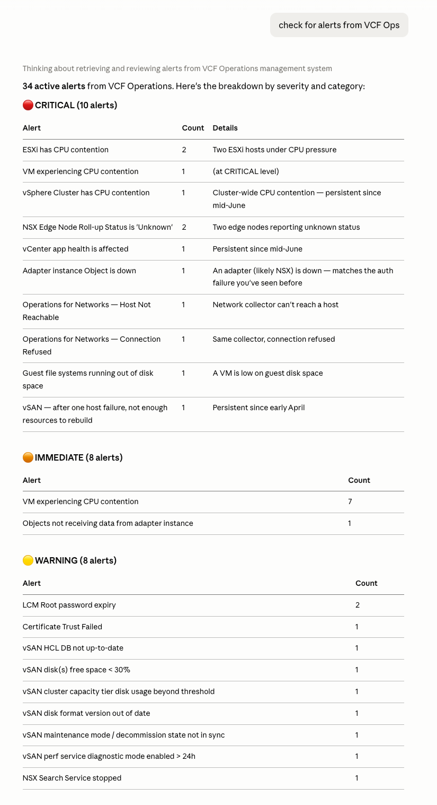
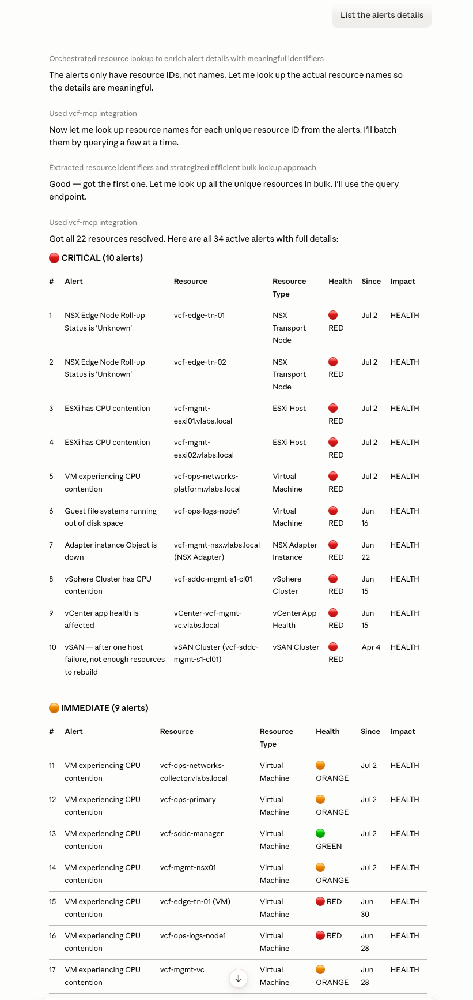
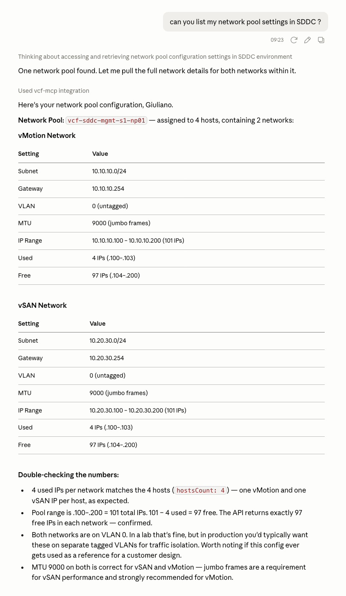
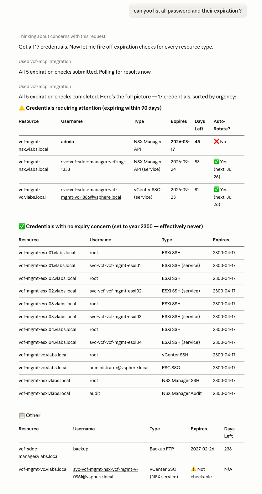
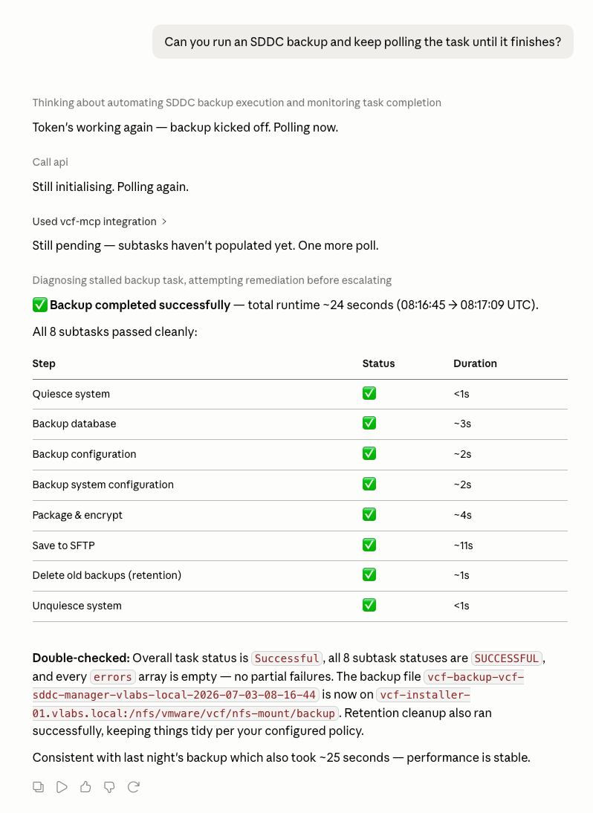

# vcf-mcp

Talk to your VMware Cloud Foundation (VCF) environment from a SaaS AI Agent (like Claude). Ask
about resource health, pull active alerts, manage certificates, or drive
lifecycle operations — without hand-writing a single API integration.

`vcf-mcp` is a Python [MCP](https://modelcontextprotocol.io) server that
exposes VCF REST APIs to any MCP-compatible client (Claude Desktop,
Claude Code, etc.) by reading their OpenAPI/Swagger specs directly, rather
than shipping a hand-coded wrapper per endpoint:

For now, it supports three VCF API specs:

- **`fleet`** — VCF Operations Fleet Management API (Swagger 2.0, 106 operations)
- **`vcf-ops`** — VCF Operations API (OpenAPI 3.0, 370 operations)
- **`sddc`** — VCF (SDDC Manager) API (OpenAPI 3.0, 375 operations)

Across the three specs that's 851 operations covering nearly everything you'd
otherwise do through the VCF UI — resource and alert management, certificate
operations, LCM/environment lifecycle, domain/workload management, auth
administration, and more — all reachable through natural-language requests.

All three spec files ship inside `specs/` and are parsed and normalized at
startup into one common shape, so the server logic doesn't care which spec
format an operation came from — see `config/openapi_utils.py` if you're
curious how that normalization works.

## How it works

Instead of 851 individual MCP tools, this server exposes 4:

| Tool | Purpose |
|---|---|
| `list_specs()` | Shows all specs, endpoint counts, and whether credentials are configured |
| `search_endpoints(spec, query)` | Keyword search over operation_id / path / summary / tags |
| `get_endpoint(spec, operation_id)` | Full parameter list + resolved request body JSON schema for one operation |
| `call_api(spec, operation_id, path_params, query_params, body, extra_headers)` | Looks up the operation, substitutes path params into the URL, attaches query params and JSON body, adds the `Authorization` header, and executes the HTTP call |

The typical flow a model follows: `search_endpoints` → `get_endpoint` → `call_api`.

## How a spec file becomes a working API call

There's no generated code and no per-endpoint wrapper anywhere in this
repo — everything the server needs to find an endpoint and call it comes
from parsing the spec file itself, at startup, in memory. Three steps:

**1. Normalize the spec once, at first use.** `openapi_utils.load_and_normalize_spec`
detects whether a spec is Swagger 2.0 (`fleet`) or OpenAPI 3.0 (`vcf-ops`,
`sddc`) by checking for a `swagger` vs `openapi` key, then converts either
shape into one common list of operations:

```python
{
    "operation_id": "getResources",
    "method": "GET",
    "path": "/api/resources/{id}",
    "summary": "...",
    "tags": [...],
    "parameters": [{"name": ..., "in": "path"|"query"|"header", "required": ..., "type": ..., "description": ...}],
    "request_body_schema": {...} | None,   # $refs already resolved into a real JSON schema
}
```

The two formats disagree about where the request body lives (Swagger 2
mixes it into `parameters` with `in: "body"`; OpenAPI 3 has its own
`requestBody.content["application/json"].schema`) and about `$ref` resolution
(`#/definitions/Foo` vs `#/components/schemas/Foo`) — `_resolve_schema`
walks either one, inlining refs recursively (cycle-safe, capped at 6 levels
deep) so `request_body_schema` always comes out as a ready-to-read JSON
schema, regardless of which spec it came from. The result is cached in
memory (`server._cache`) so a ~370-operation spec is only parsed once per
process, not once per tool call.

<details>
<summary>Concrete before/after example (from the <code>fleet</code> spec)</summary>

Raw Swagger 2.0, straight from `specs/fleet-management-api-docs.json` —
`paths["/lcm/lcops/api/depot-configuration/{depotType}"]["post"]`:

```json
{
  "operationId": "saveDepotConfigurationUsingPOST",
  "summary": "Save Depot Configuration",
  "tags": ["Settings Controller"],
  "parameters": [
    {
      "in": "body",
      "name": "depotConfigurationDTO",
      "required": true,
      "schema": { "$ref": "#/definitions/DepotConfigurationDTO" }
    },
    { "name": "depotType", "in": "path", "required": true, "type": "string", "description": "depotType" }
  ],
  "responses": { "200": {...}, "201": {...}, "400": {...}, "...": "6 more" }
}
```

After `_normalize_swagger2`, `by_operation_id["saveDepotConfigurationUsingPOST"]`:

```json
{
  "operation_id": "saveDepotConfigurationUsingPOST",
  "method": "POST",
  "path": "/lcm/lcops/api/depot-configuration/{depotType}",
  "summary": "Save Depot Configuration",
  "tags": ["Settings Controller"],
  "parameters": [
    { "name": "depotType", "in": "path", "required": true, "type": "string", "description": "depotType" }
  ],
  "request_body_schema": {
    "type": "object",
    "properties": {
      "depotType": { "type": "string" },
      "directoryPath": { "type": "string" },
      "isEnabled": { "type": "boolean" },
      "offlineDepotUrl": { "type": "string" },
      "password": { "type": "string" },
      "trustCertificate": { "type": "boolean" },
      "userName": { "type": "string" }
    },
    "title": "DepotConfigurationDTO"
  }
}
```

Three changes, matching the three things the normalizer does:

1. The `in: "body"` parameter is pulled out of `parameters` entirely and
   becomes its own `request_body_schema` key — every other parameter
   (`path`, `query`, `formData`) stays put.
2. `{"$ref": "#/definitions/DepotConfigurationDTO"}` is expanded into the
   real object shape (`properties: {depotType, directoryPath, ...}`) by
   `_resolve_schema` following the ref into `spec["definitions"]`, so
   nothing downstream ever has to chase a `$ref` itself.
3. `responses` is dropped — the normalized shape only carries what's needed
   to *make* the call, not what the server might send back.

An OpenAPI 3.0 operation (`vcf-ops`, `sddc`) starts from a different raw
shape (body under `requestBody`, refs under `#/components/schemas/...`), but
`_normalize_openapi3` produces this exact same output structure — which is
why `server.py` never needs to know or care which spec format it came from.

</details>

**2. Find the right operation by keyword, not by knowing the API.** A model
doesn't need to already know an operation's exact name — `search_endpoints`
scores every operation by how many times the query string appears across
its `operation_id`, `path`, `summary`, and `tags`, and returns the best
matches. `get_endpoint` then hands back that operation's full parameter
list and resolved body schema, so the model knows exactly what `call_api`
needs before calling it.

**3. Build the HTTP request purely from what the spec said.** `call_api`
takes the same operation dict and assembles a real request with nothing
hardcoded per-endpoint:

- the URL is `base_url` (from your env config) + `server_prefix` (the
  API's own base path, e.g. `/suite-api`, read straight out of the spec's
  `basePath` or `servers[0].url`) + the operation's `path` template, with
  any `{placeholder}` in that template substituted from `path_params` —
  and it fails fast if a required one is missing or left unresolved;
- `query_params` are attached as-is, and `body` is only sent when the
  operation actually declares a `request_body_schema` or uses a method
  that expects one;
- the `Authorization` header is derived from the spec's configured
  credentials and auth scheme (see below) — never hand-typed per call.

None of this logic branches on *which* API it's talking to. Adding a fourth
VCF API means dropping its spec file into `specs/` and adding one entry to
`config.SPECS` — `search_endpoints`, `get_endpoint`, and `call_api` pick it
up automatically because they only ever operate on the normalized shape,
never on a spec's original format.

## Setup

With [uv](https://docs.astral.sh/uv/) (recommended — used by `claude_desktop_config.json` below):

```bash
cd vcf-mcp
uv sync
cp .env.example .env   # then fill in real values
```

Or with plain pip:

```bash
cd vcf-mcp
python3 -m venv .venv && source .venv/bin/activate  # requires Python 3.10+
pip install -r requirements.txt
cp .env.example .env   # then fill in real values
```

Required environment variables (see `.env.example`):

- `FLEET_BASE_URL`, `FLEET_USER`, `FLEET_PASSWORD` — for the Fleet Management API
- `VCFOPS_BASE_URL`, `VCFOPS_USER`, `VCFOPS_PASSWORD` — for the VCF Operations API
- `VCFOPS_AUTH_SOURCE` (optional) — auth source display name, for LDAP `vcf-ops` users
- `SDDC_BASE_URL`, `SDDC_USER`, `SDDC_PASSWORD` — for the SDDC Manager API
- `FLEET_VERIFY_SSL` / `VCFOPS_VERIFY_SSL` / `SDDC_VERIFY_SSL` (optional, default
  `false`) — set to `true` to enforce TLS certificate verification; defaults to
  skipping it since lab VCF instances typically run self-signed certs
- `API_TIMEOUT_SECONDS` (optional, default `30`)

No API token is ever stored in `.env` — only a username/password pair per
spec. `call_api` derives the `Authorization` header from those credentials
at request time, per each API's own auth scheme:

- **`fleet`** — HTTP Basic (`Authorization: Basic base64(user:password)`),
  rebuilt from credentials on every call. See
  [Broadcom KB 409715](https://knowledge.broadcom.com/external/article/409715/how-to-authorize-vcf-operations-fleet-ma.html).
- **`vcf-ops`** — exchanges the username/password for a short-lived OpsToken
  (6-hour validity) via `POST /api/auth/token/acquire`, then caches that
  token **in memory only** (never written to disk). Mirrors
  `_acquire_ops_token` in `privateAI-demo/mcp/server.py`.
- **`sddc`** — exchanges the username/password for a bearer access token
  (1-hour validity) via `POST /v1/tokens`, cached the same way as `vcf-ops`.

Cached tokens aren't proactively refreshed on a timer — if a call comes back
`401`, `call_api` clears that spec's cached token and retries once with a
freshly acquired one before giving up, so a token going stale mid-process
(sddc's 1-hour window is the one to watch) self-heals on the next call.

## Running standalone

```bash
python server.py
```

This starts the server on stdio, ready to be connected to by an MCP client.

## Connecting from Claude Desktop

Add to your `claude_desktop_config.json`:

```json
{
  "mcpServers": {
    "vcf-mcp": {
      "command": "uv",
      "args": [
        "--directory", "/absolute/path/to/vcf-mcp",
        "run", "/absolute/path/to/vcf-mcp/server.py"
      ],
      "env": {
        "FLEET_BASE_URL": "https://your-fleet-management-host",
        "FLEET_USER": "admin@local",
        "FLEET_PASSWORD": "your-fleet-password",
        "VCFOPS_BASE_URL": "https://your-vcf-ops-host",
        "VCFOPS_USER": "your-vcf-ops-username",
        "VCFOPS_PASSWORD": "your-vcf-ops-password",
        "SDDC_BASE_URL": "https://your-sddc-manager-host",
        "SDDC_USER": "administrator@vsphere.local",
        "SDDC_PASSWORD": "your-sddc-password"
      }
    }
  }
}
```

> **⚠️ Security note:** `claude_desktop_config.json` stores these
> credentials in **plain text on disk** — that's true of the `env` block
> for any MCP server, not something specific to this one, but worth calling
> out explicitly since it's real VCF admin credentials sitting in a JSON
> file. This project is currently a prototype built for a personal lab; it
> hasn't been hardened for anything beyond that. Don't point it at
> production credentials as-is. See "Vault-backed secrets" below for an
> alternative that keeps passwords out of this file entirely.

## Vault-backed secrets (optional)

Instead of `FLEET_PASSWORD`/`VCFOPS_PASSWORD`/`SDDC_PASSWORD` sitting in
`claude_desktop_config.json`, you can store them in
[HashiCorp Vault](https://www.hashicorp.com/products/vault) and have
`vcf-mcp` fetch them at request time. What still ends up in the config file
is a Vault **AppRole** `role_id`/`secret_id` pair — but that pair is:

- **scoped read-only** to `secret/vcf-mcp/*` (nothing else in the vault,
  verified: an AppRole token for this role can't read a secret stored
  under a different path — it gets a `403`),
- **short-lived** (the token it exchanges for has a 1-hour TTL, 4-hour
  max — unlike a VCF password, which doesn't expire on its own),
- **revocable and rotatable independently** of the actual VCF credentials,
  and every read is audit-logged by Vault.

Compromising the `role_id`/`secret_id` pair doesn't hand over VCF admin
passwords directly — it hands over read access to one Vault path, which can
be revoked without touching VCF itself.

### Setup

```bash
# 1. Install and start Vault (dev mode, for trying this out locally —
#    NOT persistent and NOT how you'd run a real Vault):
brew install hashicorp/tap/vault
vault server -dev -dev-root-token-id="vcf-mcp-dev-root"

# 2. In another shell, provision the policy/AppRole/secrets — reads your
#    existing .env for the actual passwords, so you don't retype them:
export VAULT_ADDR=http://127.0.0.1:8200
export VAULT_TOKEN=vcf-mcp-dev-root      # the privileged setup token, NOT what vcf-mcp uses
cd vcf-mcp
uv run python -m config.vault_setup
```

That prints a `role_id`/`secret_id` pair. Put those, plus `VAULT_ADDR`, into
`claude_desktop_config.json`'s `env` block, and **remove**
`FLEET_PASSWORD`/`VCFOPS_PASSWORD`/`SDDC_PASSWORD` entirely:

```json
"env": {
  "FLEET_BASE_URL": "...", "FLEET_USER": "...",
  "VCFOPS_BASE_URL": "...", "VCFOPS_USER": "...",
  "SDDC_BASE_URL": "...", "SDDC_USER": "...",
  "VAULT_ADDR": "http://127.0.0.1:8200",
  "VAULT_ROLE_ID": "...",
  "VAULT_SECRET_ID": "..."
}
```

`config/settings.get_password()` checks for Vault first and falls back to
the plaintext `*_PASSWORD` env vars if Vault isn't configured — so this is
fully optional, not a breaking change to the setup in "Setup" above.

**Dev mode caveats** (matter if you're actually adopting this, not just
trying it): `vault server -dev` is in-memory (all secrets lost on
restart) and unsealed with a single key — fine for proving out the
integration, not how you'd run this for real. A real deployment wants
persistent storage (Vault's integrated Raft storage is the simplest
option), TLS, and a proper unseal/auto-unseal strategy.

## Example interaction

1. `search_endpoints(spec="vcf-ops", query="resources")` →
   finds `getResources`, `updateResource`, etc.
2. `get_endpoint(spec="vcf-ops", operation_id="getResources")` →
   shows its query parameters and any body schema.
3. `call_api(spec="vcf-ops", operation_id="getResources", query_params={"pageSize": 50})` →
   builds `GET {VCFOPS_BASE_URL}/suite-api/api/resources?pageSize=50` with the
   auth header attached, executes it, and returns `{status_code, url, method, ok, response}`.

## Screenshots

**Live alerts from VCF Operations** — "check for alerts from VCF Ops" pulls
all active alerts via `vcf-ops` and groups them by severity (34 alerts: 10
critical, 8 immediate, 8 warning) straight from the API, no manual lookup.



**Enriching alerts with resource names** — alerts only carry opaque resource
IDs, so a follow-up ("List the alerts details") has the model resolve each
ID to its real hostname (`vcf-mgmt-esxi01.vlabs.local`, `vcf-edge-tn-01`,
etc.) by batching lookups across `vcf-ops`, turning a list of UUIDs into a
readable table with health status and how long each alert has been active.



**Network pool configuration from SDDC Manager** — "can you list my network
pool settings in SDDC?" resolves the pool, pulls both its networks
(vMotion, vSAN) via `sddc`, and sanity-checks the numbers itself (used +
free IPs against host count, VLAN/MTU correctness) before answering.



**Credential expiration audit across the fleet** — "can you list all
password and their expiration?" fans out expiration checks across every
credential type (ESXi SSH, NSX Manager API, vCenter SSO, service accounts)
via `fleet`, then sorts 17 credentials by urgency — flagging the 3 actually
expiring soon versus the ones effectively set to never expire.



**Kicking off and polling a long-running task** — "Can you run an SDDC
backup and keep polling the task until it finishes?" triggers the backup via
`sddc`, then polls the task status on its own until all 8 subtasks
(quiesce, backup database/config, package & encrypt, save to SFTP, retention
cleanup, unquiesce) report success — no manual follow-up needed.



## Known limitations

- **Multipart/file-upload endpoints**: one Fleet endpoint
  (`uploadContentUsingPOST`) uses `multipart/form-data`, which isn't
  supported by the generic JSON-body path in `call_api`. It would need a
  dedicated code path if you need it.
- **Local `$ref` resolution only**: schemas resolve internal `#/...` refs;
  there are no external file references in either spec, so this isn't a
  practical limitation here.
- **Deeply recursive schemas** are capped at 6 levels of `$ref` resolution
  to keep `get_endpoint` output readable; deeper refs show as
  `{"$ref_name": "TypeName"}` placeholders instead of fully expanding.
